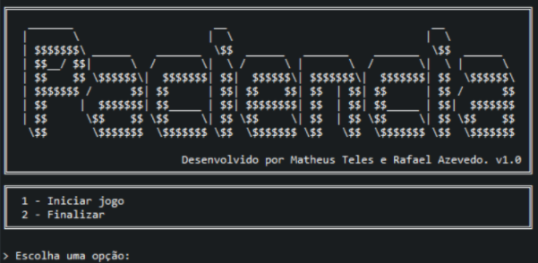
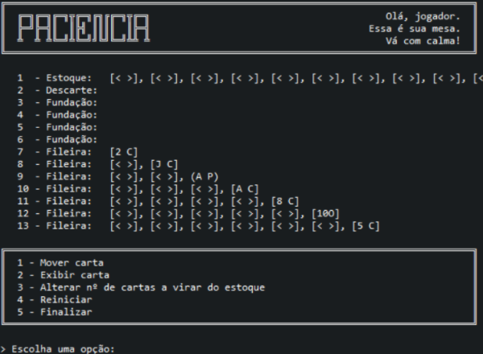
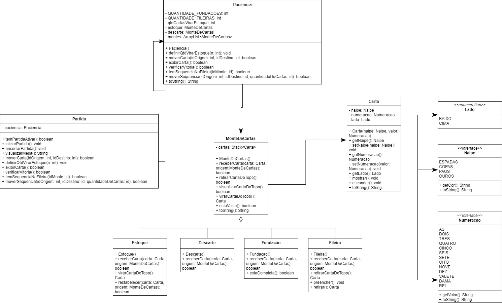

# Paciência
Esse jogo representa a primeira parte de um projeto que foi desenvolvido para a disciplina de Padrões e Frameworks (UEFS, 2021), que foi realizado a partir da linguagem de programação Java por Matheus Teles e Rafael Azevedo.

## Como o projeto implementa o Paciência
O projeto utiliza a arquitetura *MVC (Modelo, Visão e Controlador)*, no qual o Modelo possui as seguintes classes: Carta, MonteDeCartas, Estoque, Descarte, Fileira e Fundação. Carta representa uma unidade de um MonteDeCartas que é implementado utilizando uma pilha. As demais classes respeitam uma hierarquia de herança, na qual a classe pai é MonteDeCartas e implementam seus métodos que a depender da regra do jogo são sobrescritos de acordo com o tipo.  No Modelo também possui as seguintes enumerações: Naipe, Numeração (número da carta) e Lado (para cima ou para baixo) que foram utilizados como atributos de Carta.
O Controlador é representado pela classe Paciência, que possui uma coleção de MonteDeCartas que o jogador irá interagir. O construtor dessa classe é responsável pela criação do estado inicial do jogo, além disso é nessa classe que estão implementados os métodos de movimentação de cartas, definição de quantas cartas virar do estoque e verificação de vitória. 
Para que a View não acesse o controlador diretamente, ela acessa os métodos através de uma Fachada que foi nomeada de Partida.
Em Visão está implementado a interface com o usuário totalmente caracter, que permite o fluxo de ações a serem tomadas e a visualização atual do jogo, assim como a exibição da tela de vitória.

## Como jogar
Ao iniciar o jogo, a tela inicial é exibida, onde o jogador pode selecionar se irá iniciar uma partida (digitando *1*), ou se vai finalizar a aplicação (digitando *2*), como mostrado na imagem abaixo:

Agora, dentro da partida, o jogador tem a visão da mesa do jogo.
Aqui, ele pode visualizar treze pilhas, que são identificadas por números ao lado esquerdo.

As cartas pretas são identificadas pelos parênteses em volta, exemplo:
- (A P)

As cartas vermelhas são identificadas pelos colchetes em volta, exemplo:
- [5 C]

Cada naipe é representado por uma letra, onde:	
- E => Espadas
- C => Copas
- P => Paus
- O => Ouros

Para vencer uma partida, o jogador deve preencher todas as _fundações_ seguindo as regras conhecidas do ***Paciência***, que serão melhor explicadas na respectiva seção.

As cinco opções de controle são descritas a seguir.

### Mover carta
O jogador pode mover carta ao digitar *1*.
Ao selecionar essa opção, ele deve escolher um número que identifique a pilha de origem da carta, e posteriormente, um número que identifique a pilha com o destino da carta.

As regras são:

- Do estoque (pilha *1*) a carta só pode ir para o descarte (pilha *2*);
- Do descarte (pilha *2*) a carta só pode ir para qualquer uma das pilhas de fundação (pilhas *3*-*6*) ou pilhas de fileiras (pilhas *7*-*13*);
- As cartas não podem ir de nenhuma pilha para o estoque. As únicas formas das cartas voltarem pro estoque é se ele estiver vazio e for solicitado que se mova cartas do estoque para o descarte ou se ele estiver vazio e for solicitado para exibir alguma carta (caso existam cartas no descarte).
- As cartas não podem voltar de uma fundação ou fileira para o descarte.
- As cartas das _fundações_ começam com um *Ás* e precisam seguir uma ordem ascendente do mesmo naipe.
- As cartas das _fundações_ podem ir para as _fileiras_, e o contrário também.
- As cartas das _fileiras_ precisam ser encaixadas seguindo uma ordem decrescente, alternando-se as cores dos naipes.
- Caso uma _fileira_ contenha uma pilha de cartas ordenadas viradas para cima, o jogador é perguntado se é desejado mover mais de uma carta de vez.
- Se uma _fileira_ estiver vazia, só é possível inserir uma carta nela se for um rei (carta *K*)

### Exibir carta
O jogador pode exibir cartas ao digitar *2*.
Ao selecionar essa opção, uma ou três cartas saem do _estoque_ e vão para o _descarte_.
Se o _estoque_ estiver vazio, o _descarte_ é esvaziado e todas as cartas vão para o _estoque_.

### Alterar o número de cartas a virar do estoque
O jogador pode configurar a quantidade de cartas a virar do estoque ao digitar *3*.
É possível selecionar se será desejado virar uma ou três cartas por vez.

### Reiniciar
O jogador pode reiniciar a partida ao inserir *4*.

### Finalizar
O jogador pode finalizar a partida e retornar ao menu principal ao digitar *5*.

## Modelo conceitual em UML

## Modelo de baixo nível em UML

## Padrões utilizados e padrões que poderiam ser utilizados
O Padrão Façade foi utilizado para prover uma interface simplificada ao cliente.
O Padrão Iterator foi utilizado para percorrer coleções.
O Padrão Strategy foi adotado para realizar a implementação do monte de cartas, que poderia ser um estoque, descarte, fileira ou fundação, uma vez que dependendo desses tipos eles se comportam diferente em determinados métodos.
O Padrão Singleton poderia ser utilizado para restringir a classe estoque a uma única instância.
O Padrão Bridge poderia ser utilizado para adotar composições de classes e evitar heranças.

## Pontos fortes e fracos do projeto
Fortes: O principal ponto forte foi a utilização do padrão Strategy, que proporcionou diversos benefícios: como clarificar os algoritmos ao diminuir ou remover lógica condicional, simplificar a classe do jogo ao mover variações do algoritmo para a hierarquia de monte de cartas, e habilitar o algoritmo para ser substituído por outro em tempo de execução dependendo do seu tipo (estoque, descarte, fileira ou fundação). A utilização de enumerações também pode ser considerada algo positivo, pelo fato dele possibilitar uma normalização dos dados constantes.

Fracos: Em maior parte o programa foi implementado utilizando heranças, o que pode ser visto como acoplamento de classes. As implementações que envolvem a movimentação de sequência de cartas de uma fileira para outra poderiam ser melhores abstraídas, assim como foi feito para os outros tipos de movimento de cartas. 

## Créditos
Desenvolvido por Matheus Teles [@matheustdo](https://github.com/matheustdo) e Rafael Azevedo [@rrazvd](https://github.com/rrazvd).
